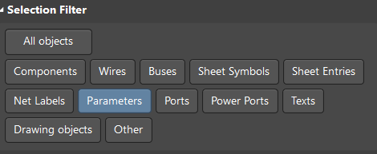
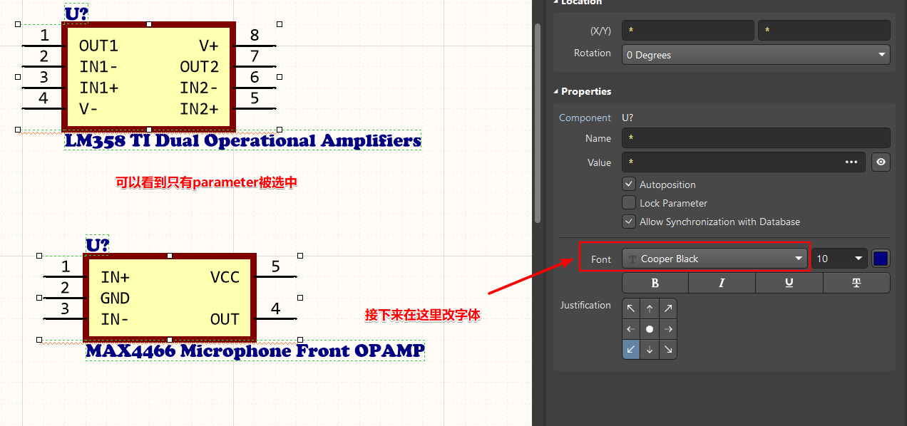

# 在原理图/库里面改变所有Designator的字体

- **STEP1** 设置选择filter，只选择Parameters

  

- **STEP2** CTRL+A选择所有Parameters，并修改相应参数

------

# 在原理图库里面设置

因为默认情况下，designator在原理图库里面是不会显示出来的。

在设计界面按下T再按下两次D，打开Document Option选项卡，如下图设置，就会显示designator了

------

> https://www.altium.com/documentation/17.1/display/ADES/Sch_Obj-Designator((Designator))_AD

